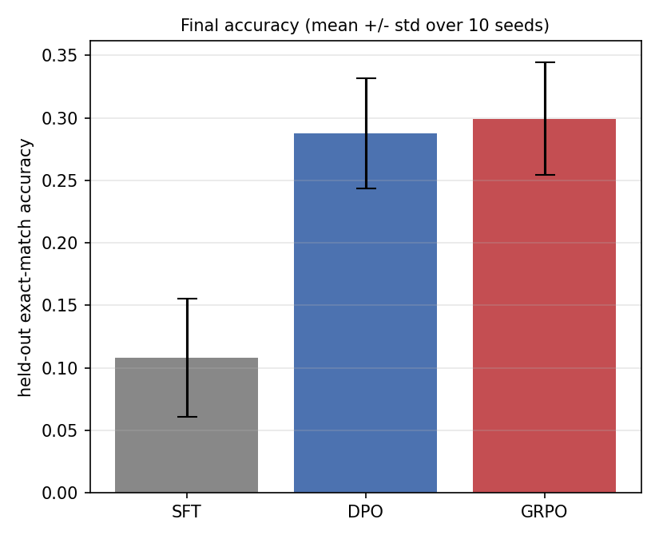
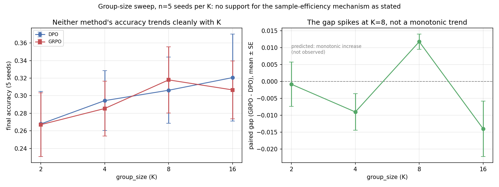

# Preference Optimization with an Exact Verifier: DPO vs. GRPO

This project asks what happens after pre-training, when the training objective
stops being next-token prediction and becomes "produce outputs a reward signal
prefers."

📄 **[Technical report (PDF)](report.pdf)** — 4–5 pages: full experimental detail, statistics, and limitations.

**Central question:** DPO and GRPO both convert a scalar reward into a policy
update, but they use the sampled data differently — DPO forms one pairwise
comparison per prompt, GRPO uses all K samples via a group-normalized
advantage. *When does that difference matter?*

## Why an exact verifier instead of preference labels

Standard RLHF learns a reward model from human preference labels. Those labels
are expensive, noisy, and irreproducible — and any comparison between two
optimization methods run on top of them is partly a comparison of how each
method tolerates label noise.

Here the reward is a Python function. The task is two-digit addition; a
completion scores 1.0 iff it states the correct sum, 0.0 otherwise:

```
prompt      "47+38="
completion  "085<eos>"        -> verify(...) == 1.0
```

This is a reinforcement-learning-from-verifiable-rewards setting, reduced to
its smallest honest form. The reward is exact, free, and deterministic, so
**any measured gap between DPO and GRPO is attributable to the optimization
method rather than to reward-model error.** That is the entire methodological
point of the setup.

The answer is zero-padded to a fixed three digits so every completion has
identical token length — removing the length-bias term that otherwise
contaminates reward comparisons.

## Architecture

The policy is a decoder-only Transformer implemented from primitives —
`model.py` here contains the full architecture, with no pretrained weights, no
`transformers` dependency, and no Hugging Face Hub access.

This is a deliberate constraint rather than a limitation: it means the entire
pipeline, from an untrained model through supervised fine-tuning to
preference optimization, is reproducible from source on any machine with
PyTorch alone.

## The three stages

```
        SFT  ──┬──►  DPO   (offline, pairwise)
               │
               └──►  GRPO  (online, group-normalized)
```

**Stage 1 — SFT** (`sft.py`): cross-entropy on correct answers, masked to
completion tokens. Deliberately stopped *short of solving the task*. If SFT
reached ~100%, there would be no headroom and the comparison would be vacuous.

**Stage 2 — DPO** (offline, pairwise preference optimization):

```
L = -log σ( β · [ (logp(y_w) − logp_ref(y_w)) − (logp(y_l) − logp_ref(y_l)) ] )
```

**Stage 2' — GRPO**: group-relative advantages replace a learned value head —
the group mean *is* the baseline:

```
A_i = (r_i − mean(r_group)) / std(r_group)
L   = −mean( A_i · logp(y_i) ) + β · KL(policy ‖ ref)
```

Both branch from the **same** SFT checkpoint and use it as their frozen
reference. Running separate SFT runs per method would confound "which objective
is better" with "which run started higher."

### One file, two objectives

DPO and GRPO live in a single `preference_optim.py` behind a `--method` flag.
They share the training loop, rollout code, evaluation, logging, and reference
model; **only the loss function differs.** Two separate scripts would let
incidental plumbing differences leak into the measured gap.

## Files

```
task.py               # the task + the exact verifier (the reward function)
policy.py             # sampling and per-sequence completion log-probabilities
rollouts.py           # on-policy sampling, preference pairs, group advantages
sft.py                # stage 1, and the shared fixed held-out evaluator
preference_optim.py   # stage 2: DPO and GRPO behind one --method flag
run_pipeline.py       # SFT once, then both methods from that checkpoint
plot_results.py       # training curves and the final cross-seed bar chart
analyze_results.py    # paired statistical analysis of comparison.csv
make_figures.py        # the group-size sweep figure above
```

## Running it

```bash
pip install -r requirements.txt

python run_pipeline.py --sft_steps 3000 --po_steps 600            # single seed
python run_pipeline.py --sft_steps 3000 --po_steps 600 --n_seeds 3  # with uncertainty

python analyze_results.py --csv results/comparison.csv   # paired analysis
python plot_results.py --run_dir results/seed42 --out results/curves.png
python plot_results.py --comparison_csv results/comparison.csv --out results/final.png
```

Verified end-to-end on CPU. The full configuration wants a GPU: SFT is the
cheap part, but each preference-optimization step samples `batch_size ×
group_size` completions autoregressively, which dominates the cost.

## Correctness checks

Preference-optimization code fails *silently* — a wrong log-probability trains
without error and quietly optimizes the wrong objective. Three checks are built
in rather than assumed:

1. **`python policy.py`** recomputes `completion_logprobs` token-by-token by
   brute force and asserts agreement. Measured difference: **0.0**. This catches
   the classic off-by-one in the logits/targets shift, and the equally classic
   error of summing over prompt tokens as well as completion tokens.
2. **`python rollouts.py`** asserts that a prompt group with mixed rewards
   yields exactly one usable preference pair while a uniform-reward group
   yields none.
3. **DPO loss at initialization is exactly `0.6931 = log 2`.** At step 0 the
   policy *is* the reference, so the DPO logit must be identically zero. Any
   other starting value means the reference model is wired up wrong.

Two real bugs were found and fixed this way, both of which would have corrupted
the headline comparison while producing plausible-looking output:

- **Evaluation drew fresh problems on every call.** A single shared RNG was
  threaded through the evaluator, so each evaluation scored a *different*
  problem set. Measured spread between two eval seeds on one checkpoint: 0.125
  vs 0.070 accuracy — larger than the SFT→DPO effects being measured. Fixed by
  rebuilding `random.Random(eval_seed)` inside every call, making all
  evaluations score an identical fixed held-out set.
- **Eval set size was tied to the training batch size.** SFT and DPO therefore
  evaluated *the same checkpoint* on differently-sized sets and reported two
  different accuracies for one model (0.010 vs 0.028), making the "delta vs
  SFT" column meaningless. Fixed by pinning the held-out set to a constant
  problem count independent of any training hyperparameter. After the fix, SFT
  final and DPO start report identical numbers for the identical checkpoint.

## Results

**10 seeds** (42–51), SFT 3000 steps, preference optimization 500 steps,
`group_size=8`, `beta=0.1`. Held-out exact-match accuracy on the fixed
512-problem set:

| | accuracy | vs. SFT |
|---|---|---|
| SFT | 0.108 ± 0.050 | — |
| DPO | 0.288 ± 0.046 | **+0.180** (3.6σ of the SFT spread) |
| GRPO | 0.299 ± 0.047 | **+0.191** (3.9σ of the SFT spread) |



*Error bars are ±1 std across the 10 seeds. Note that DPO's and GRPO's bars
overlap heavily — which is exactly why the unpaired comparison in Finding 2
fails to detect a difference that is present on every single seed.*

### Finding 1 — verifier-based preference optimization works, decisively

Both methods roughly **triple** held-out accuracy over the SFT policy they
started from, from a reward that costs nothing to produce and carries no label
noise: the policy generates candidates, a Python function scores them, and that
signal alone more than doubles what supervised learning on correct answers
achieved.

`usable_group_frac` — the fraction of prompt groups containing both a correct
and an incorrect sample, i.e. the only groups carrying signal — climbs during
training as the policy improves (0.38 → 0.81 on seed 42, 0.31 → 0.88 on seed
46). This confirms the dependence the design assumed: both methods need the
policy to be *partially* correct, and both get more efficient as it becomes so.

### Finding 2 — GRPO beats DPO, and the default analysis hides it

This is the result the project exists to produce, and it only becomes visible
under the right test.

**The unpaired view** — what `run_pipeline.py` prints:

```
DPO  0.288 +/- 0.046
GRPO 0.299 +/- 0.047
gap = +0.0117 = 0.25 sigma of DPO's own spread   ->   "noise"
```

**The paired view** — both methods branch from the *same* SFT checkpoint on
every seed, so per-seed SFT quality is a shared nuisance term that pairing
cancels:

| seed | GRPO − DPO | | seed | GRPO − DPO |
|---|---|---|---|---|
| 42 | +0.0137 | | 47 | +0.0156 |
| 43 | +0.0117 | | 48 | +0.0234 |
| 44 | +0.0039 | | 49 | +0.0039 |
| 45 | +0.0117 | | 50 | +0.0117 |
| 46 | +0.0176 | | 51 | +0.0039 |

**mean +0.0117 ± 0.0064, paired t = 5.75 (df = 9), GRPO ahead on 10/10 seeds,
sign test p = 0.00098.**

Same data. The unpaired test calls it noise at 0.25σ; the paired test rejects
the null at p < 0.001. Nothing about the experiment changed — only whether the
analysis respects the design.

The effect is small in absolute terms (**+1.2 percentage points**) and should be
reported that way. But its *consistency* is the point: ten independent runs, ten
times the same direction, on an effect an order of magnitude smaller than the
between-seed spread that was hiding it.

Why GRPO might hold an edge here: it uses all K = 8 sampled completions per
prompt via a group-normalized advantage, while DPO reduces each group to a
single best/worst pair and discards the rest. At this group size that is a 4×
difference in samples consumed per update — a mechanism consistent with the
sign but not tested by this experiment.

### Finding 3 — a correlation that is mostly an artifact, reported as such

The gain from preference optimization correlates strongly and negatively with
SFT accuracy: **r = −0.871** (t = −5.00, df = 8). Read naively: the worse the
SFT checkpoint, the more preference optimization helps.

**That number should not be trusted.** Gain is computed as `final − SFT`, so SFT
appears on both sides with opposite signs; a *noisy* SFT measurement alone
manufactures a negative correlation with no underlying effect. And SFT accuracy
here is demonstrably noisy — seed 50 swings 0.234 → 0.141 over its final 250
steps, seed 46 ends at 0.020 after touching 0.186.

The clean test regresses SFT accuracy against **final** accuracy, where no
shared term exists: **r = −0.491, t = −1.60 (df = 8)** — the sign survives but
the effect does not reach significance at n = 10.

So the honest statement is: *there is a hint that runs with weaker SFT
checkpoints finish at least as strong, consistent with an over-trained SFT
policy being harder for preference optimization to move, but this experiment
does not establish it.* The two extreme cases are suggestive — seeds 46 and 48
had SFT collapse to 0.020 and 0.025 and still finished at 0.338 and 0.330,
above the 10-seed mean — and that is all they are.

### An observation worth flagging

SFT accuracy is strikingly unstable between checkpoints — seed 42 goes
0.133 → 0.010 → 0.135 over 500 steps; seed 48 ends at 0.025 after reaching
0.127. Since the held-out set is fixed and identical at every evaluation, this
is real policy instability, not evaluation noise: under greedy decoding a small
weight change flips many answers, because a three-digit answer scores correct
only if all three digits are.

That fragility is part of why preference optimization helps so much here, and it
is the reason this pipeline reports final-checkpoint numbers rather than
best-checkpoint ones — with SFT this noisy, best-checkpoint selection would
mostly be selecting on evaluation noise.

## The group-size mechanism test — attempted, inconclusive

Finding 2 established that GRPO beats DPO on 10/10 seeds. The proposed
mechanism: GRPO uses all K sampled completions per prompt via a group-
normalized advantage, DPO reduces each group to one pair, so the gap should
**grow with K** and **vanish at K=2**, where both methods see the same data.

`group_size` was swept over {2, 4, 8, 16} at 5 seeds each (42–46):



| K | DPO | GRPO | paired gap (GRPO−DPO) | SE | seeds ahead |
|---|---|---|---|---|---|
| 2 | 0.268 | 0.267 | −0.001 | 0.007 | 3/5 |
| 4 | 0.294 | 0.285 | −0.009 | 0.005 | 1/5 |
| **8** | 0.306 | **0.318** | **+0.012** | 0.002 | **5/5** |
| 16 | 0.321 | 0.307 | −0.014 | 0.008 | 1/5 |

**This does not support the mechanism as stated.** The prediction was a
monotonic trend; what is observed is a spike at K=8 — the default value used
throughout the rest of this project — with DPO nominally ahead at every other
K tested. Read literally, this table says GRPO's advantage is specific to
K=8, which is not a mechanistic explanation, it's a description of one data
point.

**The honest reason not to trust the K∈{2,4,16} numbers either way**: n=5
seeds per K. Five seeds is a sample size at which a directionally consistent
result can appear and then reverse when more seeds are added — the headline
result in this very project needed ten seeds before its effect was reliably
detectable. The correct conclusion is not "DPO wins at K=2/4/16" — it is
**this experiment cannot yet distinguish the mechanism hypothesis from
noise**, in either direction.

**One thing this sweep does establish cleanly**: the K=8 arm, run
independently at seeds 42–46, reproduces the original 10-seed experiment's
per-seed gaps almost exactly (+0.0130 vs +0.0137, +0.0120 vs +0.0117, +0.0040
vs +0.0039, +0.0120 vs +0.0117, +0.0180 vs +0.0176 — differences under
0.001 on every seed). That is a real result, just not the one this sweep was
designed to find: **the pipeline is deterministic enough, given a fixed seed,
that independent reruns reproduce each other to three decimal places.** That
is worth more confidence than the K-sweep's headline comparison, and it is
the reason the 10-seed Finding 2 result can be trusted as a measurement, even
though the mechanism behind it is still unexplained.

## Path to a publishable result

The harness is built, the headline run is done at n = 10 (GRPO > DPO,
p < 0.001), and the mechanism experiment has been run once — inconclusively.
What is missing:

1. **More seeds on the group-size sweep.** Five per K was not enough to
   distinguish the sample-efficiency hypothesis from noise, and it is not
   enough to rule it out either — a K=8-specific effect is possible but
   unproven, a monotonic trend is not supported but not excluded. Ten seeds
   per K (matching Finding 2's design) is the direct next step, and the
   harness needs no changes to run it.
2. **The SFT-quality axis.** The interesting variable is not "DPO or GRPO" in
   the abstract but **the base policy's success rate**. The results above make
   this concrete: `usable_group_frac` rose from 0.38 to 0.84 as the policy
   improved, so both objectives are demonstrably sensitive to it. The
   hypothesis worth testing is that they degrade *differently* at the extremes
   — GRPO uses all K samples and should retain signal longer near 0% and 100%,
   DPO needs only one correct/incorrect pair and may be more sample-efficient
   in the middle. Finding 3 gestures at this but cannot establish it, because
   SFT quality was left to vary by chance rather than controlled. Varying
   `--sft_steps` deliberately turns an uncontrolled correlation into a
   designed experiment.
3. **A real task.** Two-digit addition is a controlled setting, not a
   benchmark. GSM8K with a numeric-answer verifier is the natural next step and
   changes nothing structural about the pipeline.
4. **A real model.** The from-scratch Transformer keeps the project
   self-contained; a small pretrained model (sub-1B parameter class) is needed
   before any claim generalizes.

The honest framing: **the infrastructure is validated and two results are
confirmed** — preference optimization triples accuracy over SFT, and GRPO
beats DPO on 10/10 seeds at p < 0.001, though by only 1.2 points. The
mechanism behind the second result is now **an open question with one failed
explanation** (sample efficiency, as tested, does not produce a monotonic
trend) rather than an untested hypothesis — progress, even if not the clean
confirmation the experiment was designed to produce. Item 1 is the cheapest
way to find out whether K=8 is special or five seeds simply were not enough;
items 2–4 are the cost of generalizing beyond two-digit addition.

## Scope and honesty

- The verifier is exact by construction, which is the *point* of the design and
  also its main limitation: real RLHF reward models are learned and noisy, and
  conclusions here do not transfer to that setting without re-testing.
- GRPO here uses a single-sample KL estimator and no PPO-style clipped ratio or
  multiple inner epochs per rollout batch. It is the group-relative advantage
  idea, not a full reproduction of any specific published GRPO implementation.
- DPO is implemented on **on-policy** samples scored by the verifier, not on a
  fixed offline preference dataset. This is the sensible choice given a free
  verifier, but it is a departure from the original DPO setting and makes the
  comparison to GRPO closer than it would otherwise be.
- No reward model is trained. There is no reward-model-error term anywhere in
  this pipeline, by design.

## Scope

This project holds architecture fixed and intervenes only on the **training
objective**, isolating the effect of how preference signal is used from any
question of model design. It connects to the reinforcement learning and
sequential decision-making in my M.Sc. thesis.
